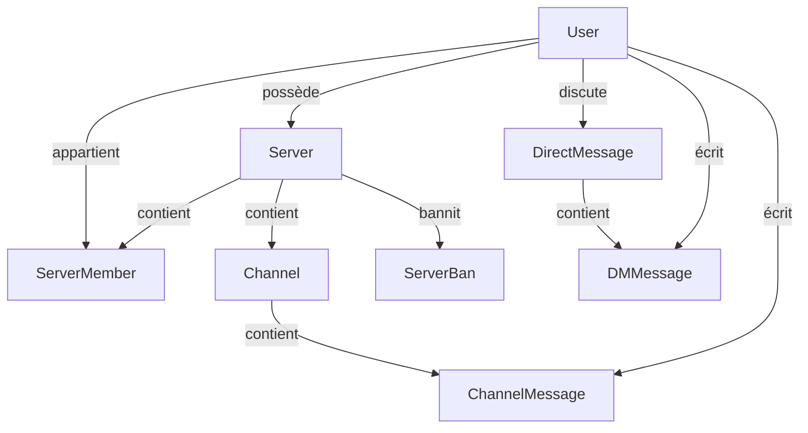

# Description des entites - Hello World RTC

## Enumerations

### `UserStatus`
| Valeur | Description |
|--------|-------------|
| `Online` | Connecté et disponible |
| `Offline` | Déconnecté |
| `Dnd` | Ne pas déranger |
| `Invisible` | Invisible pour les autres |

### `MemberRole`
| Valeur | Description |
|--------|-------------|
| `owner` | Propriétaire (Contrôle total) |
| `admin` | Administrateur (Gestion & Modération) |
| `member` | Membre standard |

---

## Entites PostgreSQL

### `User`
| Attribut | Type | Description |
|----------|------|-------------|
| `id` | UUID | Identifiant unique |
| `email` | String | Email de connexion |
| `username` | String | Pseudo affiché |
| `avatar_url` | String? | Lien vers l'image |
| `status` | UserStatus | État de présence |

### `Server`
| Attribut | Type | Description |
|----------|------|-------------|
| `id` | UUID | Identifiant unique |
| `name` | String | Nom de la communauté |
| `owner_id` | UUID | FK → User (Propriétaire) |

### `ServerMember`
| Attribut | Type | Description |
|----------|------|-------------|
| `server_id` | UUID | FK → Server |
| `user_id` | UUID | FK → User |
| `role` | MemberRole | Droits dans le serveur |

### `ServerBan`
| Attribut | Type | Description |
|----------|------|-------------|
| `server_id` | UUID | FK → Server |
| `user_id` | UUID | FK → User banni |
| `banned_by` | UUID | FK → User modérateur |
| `reason` | String? | Motif du ban |
| `expires_at` | DateTime? | Date de fin (null = permanent) |

### `Channel`
| Attribut | Type | Description |
|----------|------|-------------|
| `id` | UUID | Identifiant unique |
| `server_id` | UUID | FK → Server parent |
| `name` | String | Nom du salon textuel |
| `position` | Int | Ordre de tri |

### `DirectMessage` (Conversation)
| Attribut | Type | Description |
|----------|------|-------------|
| `id` | UUID | Identifiant de la conversation |
| `user1_id` | UUID | FK → User 1 |
| `user2_id` | UUID | FK → User 2 |

### `Invite`
| Attribut | Type | Description |
|----------|------|-------------|
| `id` | UUID | Identifiant unique |
| `code` | String | Code d'invitation unique |
| `uses` | Int | Nombre total d'utilisations |
| `revoked` | Boolean | État de validité |

---

## Entites MongoDB

### `ChannelMessage`
| Attribut | Type | Description |
|----------|------|-------------|
| `message_id` | UUID | Référence unique |
| `channel_id` | UUID | Salon cible |
| `author_id` | UUID | Auteur du message |
| `content` | String | Texte du message |
| `reactions` | List | Tableau des réactions (emoji + user_id) |
| `deleted_at` | DateTime? | Date de suppression logique |

### `DMMessage`
| Attribut | Type | Description |
|----------|------|-------------|
| `message_id` | UUID | Référence unique |
| `dm_id` | UUID | Conversation cible |
| `author_id` | UUID | Auteur du message |
| `content` | String | Texte du message |

---

## Relations Globales

